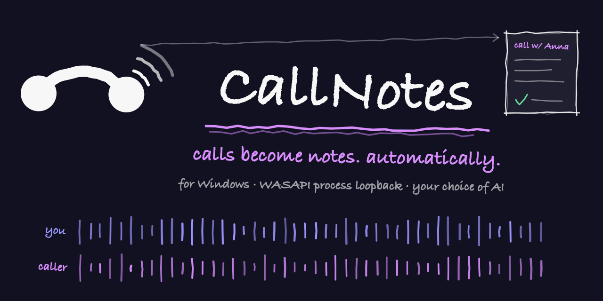
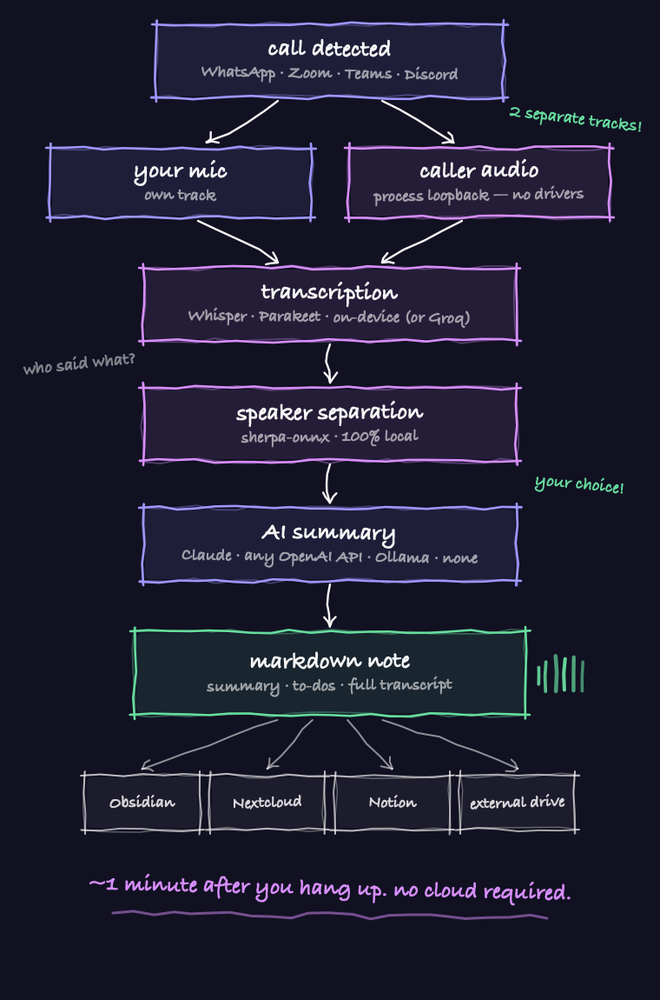

<p align="center">
  <b>🇬🇧 English</b>&nbsp;&nbsp;·&nbsp;&nbsp;<a href="README.de.md">🇩🇪 Deutsch</a>
</p>

<h1 align="center">CallNotes for Windows</h1>

<p align="center">
  
</p>

<p align="center">
  ⚠️ <b>Experimental</b> — code-complete sibling of
  <a href="https://github.com/michaelczesun/callnotes">CallNotes for macOS</a>;
  CI-compiled on Windows, looking for testers — please report your first run in
  the issues!
</p>

<p align="center">
  You take a call on Windows — CallNotes records <b>both sides as separate tracks</b>,
  transcribes locally with Whisper, separates speakers, and drops a finished,
  AI-summarized note wherever you want it. Fully automatic, from the tray icon.
</p>

<p align="center">
  
  
  
</p>

---

## This is the Windows port

This project is a from-scratch C# reimplementation of
[**CallNotes for macOS**](https://github.com/michaelczesun/callnotes) — **the
original** — kept in lockstep with it: same config keys, same state-file shapes,
same processing pipeline (whisper.cpp, sherpa-onnx, your choice of AI). If you're
on a Mac, use that one; it's the mature, daily-driven version. This repo exists so
Windows users get the same tool, built on the Windows-native equivalent of the
Mac's capture technology.

**Why it needs its own recorder core, not a straight port:** the Mac app captures
system audio via Core Audio *Process Taps* (macOS 14.2+), a macOS-only API with no
Windows equivalent. Windows has a different but conceptually parallel capability
since **Windows 10 Build 20348**: **WASAPI Process Loopback Capture**
(`ActivateAudioInterfaceAsync` + `AUDIOCLIENT_ACTIVATION_TYPE_PROCESS_LOOPBACK`).
It captures only the audio *rendered by one process* (+ its child-process tree) —
no virtual audio driver, no system-wide loopback, no Stereo Mix hack. That's the
Windows-native analogue of the Mac's per-app Process Tap, and the reason this
project has a hand-rolled C# recorder core ("CallTap") instead of reusing NAudio's
stock loopback capture (which only wraps the classic full-endpoint loopback, not
per-process). Everything downstream — the Python processing pipeline, config
schema, state files, note format — is reused unchanged from the Mac project.

## Why this exists

Every call-recording tool either needs a virtual audio driver, a visible meeting
bot, or a cloud subscription. CallNotes needs none of that:

- **WASAPI process loopback capture** grabs the system audio of *just the call
  app* (+ its process tree) — your caller lands on its own track, background
  music doesn't.
- Your microphone is recorded in parallel — **two separate tracks means perfect
  speaker attribution for 1:1 calls, no AI guessing needed.**
- For conference calls, local **speaker diarization** (sherpa-onnx) splits the
  remote mix into "Speaker 1..N" — you match names via short audio snippets and a
  dropdown.
- Transcription runs **on-device** (whisper.cpp) — or via the Groq API if you
  prefer speed over full offline. Your choice, one config key.
- **Parakeet TDT v3** (sherpa-onnx, on-device) is the fastest local option, with
  support for 25 EU languages — grab it via `install.ps1 -WithParakeet`.
- **Bring your own AI** for summaries: Claude Code (default), any
  OpenAI-compatible API (OpenAI, Groq, OpenRouter), fully local via **Ollama** —
  or none at all.

## How it works

<p align="center">
  
</p>

## What you get after hanging up

A finished Markdown note, about a minute later:

- **Summary, discussed points, commitments & to-dos, open questions** (optional —
  pick the sections you want, including a follow-up email draft)
- **Dialog transcript with speakers** ("Me: … / Caller: …"), timestamps included
- **Audio archive** (`mic.wav` + `system.wav`)
- Delivered to your **notes folder** (Obsidian-friendly), plus optionally
  **Nextcloud, Notion**, and an **ntfy push**

## The tray app

Everything lives in the system tray (phone icon):

- **Live view during a call** — level meters for mic + system audio, call timer,
  and a popup to type in participant names while you still remember them
- **Processing status** after hangup (transcribing → speaker detection → AI
  summary)
- **Speaker assignment** for conferences: play a voice snippet per detected
  speaker, pick the name from a dropdown
- **Recent calls**, storage locations, API keys, integrations
- **First-run setup wizard** and a settings UI with an ⓘ explainer next to every
  field, mirroring the Mac app's settings
- **English & German UI** — follows your system language automatically
  (`uiLanguage: "system" | "de" | "en"`)

`CallTap.Cli` (the headless `calltap.exe`) works standalone too, without the tray
app, for scripting or a Scheduled-Task-based setup.

## What v1 can do — and what's (still) missing

**Works today — first field test passed on real Windows (11 ARM64 24H2, 2026-07-03):
`calltap procs` runs clean, and two-track capture is proven — a 440 Hz test tone
recorded via process loopback at −0.1 dBFS peak, microphone captured in parallel.
Native ARM64 build works. Still experimental — more machines, more reports, please:**

- Per-app system-audio capture via WASAPI process loopback (include/exclude the
  target process's child-process tree)
- Parallel microphone capture (NAudio `WasapiCapture`)
- The full watch-loop state machine ported line-for-line from the Mac's
  `calltap.swift` (`minSeconds`/`stopGraceSeconds`/`maxHours`, suppress-after-discard,
  abort-file discard protocol, orphaned-recording cleanup on startup)
- The same Python processing pipeline: **whisper.cpp / Parakeet TDT v3 / Groq**
  transcription, sherpa-onnx diarization, transcript merge, AI summary, Markdown
  note + MOC maintenance, Nextcloud/Notion delivery
- `calltap procs [--watch]` / `calltap setup` / `calltap record` / `calltap watch`
  CLI, same shape as the Mac's `calltap`

**What's missing or Windows-specific by design — not oversights:**

- **No iPhone/cellular calls.** The Mac app's Continuity-based phone-call capture
  has no Windows analogue at all — this is a hard platform boundary, not a
  to-do. v1's `apps` allowlist covers **desktop VoIP apps only**: WhatsApp, Zoom,
  Teams, Discord.
- **No Apple Notes destination.** There's no Windows equivalent of Apple's Notes
  automation surface. `destinations.appleNotes` is parsed and silently ignored
  (with a log warning) so `config.json` stays portable between the two sibling
  projects; only **Nextcloud** and **Notion** are implemented as extra delivery
  destinations on Windows.
- **Signal Desktop / Telegram Desktop** are in the Mac app's example `apps` list
  but excluded from the Windows v1 target list on purpose — adding them later is
  a one-line config change (`ProcessMatcher` is exe-name-driven and generic), it
  just hasn't been verified yet.
- **No MSIX/Store packaging.** Ships as a signed portable EXE + PowerShell
  installer, same "clone and install" philosophy as the Mac app's `install.sh`.
- **win-x64 only** for now — `net8.0-windows` and NAudio both support
  `win-arm64`, but there's no ARM64 Windows test coverage yet.
- **Tested in a VM so far, not on bare metal.** The field test above ran in a
  Windows 11 ARM64 VM (UTM/QEMU on Apple Silicon): build, `procs`, `setup` and a
  real loopback recording all pass there. Bare-metal machines, x64 hardware and
  real VoIP calls are exactly what's untested — reports in the issues are the
  most useful thing you can contribute right now.

## Runs locally — what lands on your machine

Everything processes on your PC: .NET 8 + Git (build), Python (pipeline),
whisper.cpp (`whisper-cli.exe` + a ggml model — on machines with ≤ 8 GB RAM
pick `ggml-small`, not large) and optionally sherpa-onnx for speaker
separation/Parakeet. `installer/install.ps1` sets all of it up; no cloud is
required (Groq and the AI summary are opt-in). Installing or debugging with an
AI assistant? Point it at **[CLAUDE.md](CLAUDE.md)** — it contains the local
dependency list and the field-tested traps.

## Install

Requires **Windows 10 Build 20348+ or Windows 11** (older Windows 10 builds don't
support process-loopback activation — `calltap setup` tells you clearly if your
build is too old).

```powershell
git clone https://github.com/michaelczesun/callnotes-windows
cd callnotes-windows
./installer/install.ps1
```

`install.ps1` installs dependencies (ffmpeg, Python) via winget/choco, sets up a
Python venv with the pipeline's requirements, writes a default
`%APPDATA%\callnotes\config.json`, and registers a Scheduled Task / Startup
shortcut for the tray app. It also walks you through the Windows privacy prompt
for microphone access (Settings → Privacy & security → Microphone → allow desktop
apps).

Grab the Whisper model once (~550 MB):

```powershell
mkdir $env:USERPROFILE\models -Force
curl.exe -L -o $env:USERPROFILE\models\ggml-large-v3-turbo-q5_0.bin `
  https://huggingface.co/ggerganov/whisper.cpp/resolve/main/ggml-large-v3-turbo-q5_0.bin
```

**First launch:** run `calltap setup` once — it requests microphone access
(triggers the Windows consent prompt) and runs a harmless self-test activation of
process-loopback capture to confirm your machine/OS build actually supports it.

Then make a test call (>20 s). Watch `%USERPROFILE%\CallNotes\log\process.log` if
you're curious.

## Supported call apps

WhatsApp (Desktop), Zoom, Microsoft Teams (new/WebView2-based), Discord — anything
that uses the microphone and is in your allowlist. Find any app's executable name
with `calltap procs --watch` during a call (unknown active-mic processes are also
logged automatically so you can add them).

## Configuration

Everything is in `%APPDATA%\callnotes\config.json` — same keys as the Mac app,
with `apps` holding **executable names** instead of bundle IDs. Highlights:

| Key | What it does |
|---|---|
| `apps` | executable names that trigger recording (e.g. `WhatsApp.exe`) |
| `tapScope` | `app` = record only the call app's process tree via process-loopback (default), `global` = classic full-endpoint loopback, no process filter |
| `minSeconds` / `stopGraceSeconds` / `maxHours` | discard-if-too-short threshold, hangup debounce, forced max recording length |
| `transcriber` / `groqApiKey` | `local` (whisper.cpp) or `groq` (cloud, faster) |
| `summarizer` (+ `summarizerUrl/Model/ApiKey`) | `claude` (Claude Code CLI), `openai` (any OpenAI-compatible API incl. Ollama/Groq/OpenRouter) or `off` |
| `noteSections` | which sections get written: summary, discussed, todos, follow-up email |
| `destinations` | extra delivery: Nextcloud (WebDAV), Notion (no Apple Notes on Windows) |
| `notesDir` / `audioDir` / `mirrorDir` | where notes, audio and the external-drive mirror go |
| `diarize` / `diarizeThreshold` | multi-speaker detection on/off, clustering threshold |
| `speakerSelf` / `speakerPeer` / `context` | your name / peer label in transcripts + one line of context for better summaries |
| `micDeviceId` | *(Windows-only)* override the NAudio capture endpoint; empty = default mic |
| `processLoopbackMode` | *(Windows-only)* `includeTree` (default) or `excludeTree` — maps directly to `PROCESS_LOOPBACK_MODE` |
| `venvPython` | path to the pipeline's Python venv interpreter |

`%APPDATA%`, `%USERPROFILE%`, `%LOCALAPPDATA%` inside `config.json` are expanded
by the app at load time — they're plain string placeholders in the JSON, not
literal environment-variable references.

## CLI

```powershell
calltap.exe procs [--watch]              # which process is using the mic right now?
calltap.exe setup                        # permission + process-loopback capability check
calltap.exe record --out DIR [--exe NAME] # manual recording (Ctrl-C stops)
calltap.exe watch [--config FILE]        # foreground watch daemon
python pipeline/process_call.py DIR      # (re)process a recording
```

## Troubleshooting

- **`calltap setup` fails the process-loopback self-test:** your Windows build is
  older than Build 20348 (Windows 10 20H1-era or earlier) — this API doesn't exist
  there. Update Windows, or fall back to `"tapScope": "global"` (works on any
  WASAPI-capable Windows, but captures *all* system audio, not just the call app).
- **System track is silent:** check Settings → Privacy & security → Microphone →
  allow desktop apps; also confirm the target app isn't muted at the Windows
  volume-mixer level (process loopback still captures silence if the app itself
  produces none).
- **Recording never starts:** check `%USERPROFILE%\CallNotes\log\callwatch.log` —
  if it logs an active mic session for an unlisted process name, add that exe
  name to `apps`.
- **Caller audio missing in WebView2/Electron-based apps** (Teams, Discord,
  WhatsApp): audio may render from a helper process; `tapScope: "app"`
  (include-tree mode) should already cover the whole process family rooted at the
  matched executable. If it still misses audio, this is one of the project's open
  verification questions (see `docs/contract.md` §11) — please report it as an
  issue with the app version.
- **Switched audio output mid-call** (e.g. connected Bluetooth headset): the
  running capture can go silent — switch before the call, or accept the gap.
- Failed jobs land in `%USERPROFILE%\CallNotes\failed\` with raw audio; reprocess
  with `python pipeline/process_call.py <dir>`.

## FAQ

**Is this as mature as the Mac version?**
No, not yet — that's the point of the "experimental" label. The macOS app has
been used daily by its author for a while; this Windows port is code-complete and
compiles/marshals correctly in CI, but has not accumulated the same real-world
call-hours. If you try it, please open an issue with your Windows build number
and what happened on your first call — that's the most valuable thing right now.

**Why C# instead of a straight code port?**
The Mac app's capture core is Swift + Core Audio Process Taps, which simply don't
exist on Windows. The Windows-native equivalent (WASAPI process loopback) needed
its own interop layer (see `docs/contract.md` §1 and §7 for the full technical
rationale and code). Everything that *isn't* platform-specific capture — the
Python processing pipeline — is reused unchanged.

**Why no App Store / signed MSIX?**
It ships as a portable EXE + PowerShell installer for now, same "clone and
install" philosophy as the Mac app. MSIX sandboxing would also complicate the raw
process-loopback COM activation this project depends on.

## Privacy & legal

Everything runs locally by default (Whisper on-device); only the summary — if
enabled — goes to your chosen AI provider, and transcription goes to Groq only if
you opt in. **Tell people you're recording.** Laws differ by country (e.g.,
secretly *sharing* recordings is criminal in Austria, secretly *making* them is
criminal in Germany). You are responsible for lawful use.

## License

[PolyForm Noncommercial 1.0.0](LICENSE) — free for personal and noncommercial use.
**Selling this software or using it commercially is not permitted.**

---

<p align="center"><sub><a href="README.de.md">🇩🇪 Diese Seite auf Deutsch</a> · <a href="https://github.com/michaelczesun/callnotes">The original: CallNotes for macOS</a></sub></p>
